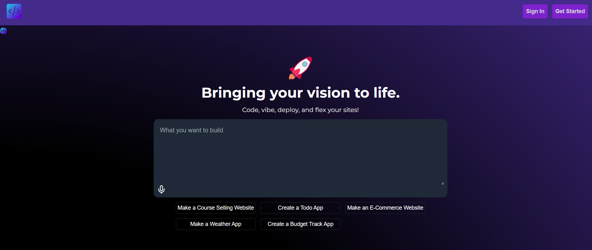
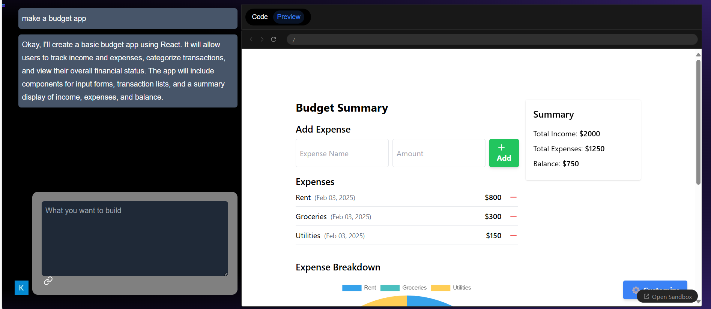
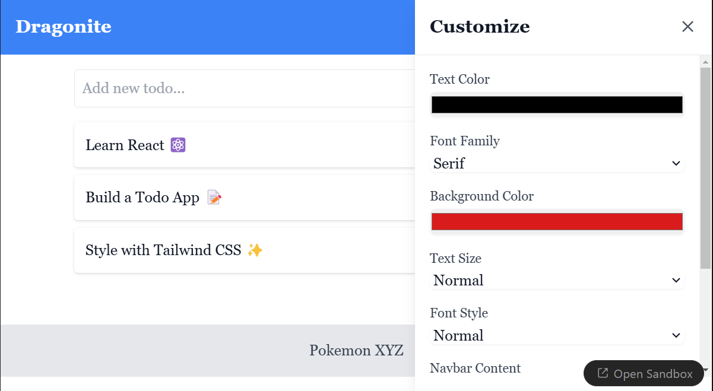

## Getting Started

## Set Up


- Step 1: Clone this repository into your local machine. (See [here](https://docs.github.com/en/repositories/creating-and-managing-repositories/cloning-a-repository))
```bash
git clone https://github.com/Sanyam243/Kriti-Dev-Project.git
```
- Step 2: Install all the dependencies. 
```bash
npm install
```
- Step 3: Install all the dependencies. 
```bash
npx convex dev
```
A .env.local file can be seen in your project

- Step 4: Get GOOGLE CLIENT ID.


Follow these steps to get your Google Client ID for authentication:

### 1. Go to the Google Developer Console
- Visit the [Google Developer Console](https://console.developers.google.com/).

### 2. Create a New Project
- Click on the **"Select a Project"** dropdown on the top of the page.
- Click on **"New Project"** and give it a name.
- Click **"Create"**.

### 3. Enable Google API
- In the left sidebar, click on **"APIs & Services"** > **"Library"**.
- Search for **"Google+ API"** or **"OAuth 2.0"**.
- Enable the API by clicking **"Enable"**.

### 4. Configure OAuth Consent Screen
- In the left sidebar, click on **"OAuth consent screen"**.
- Choose an **External** or **Internal** user type depending on your needs.
- Fill in the necessary fields (app name, user support email, etc.).
- Click **Save**.

### 5. Create OAuth 2.0 Credentials
- In the left sidebar, go to **"Credentials"**.
- Click on **"Create Credentials"** > **"OAuth client ID"**.
- Choose **"Web Application"**.
- Under **"Authorized JavaScript origins"**, add the URL where your application will be running (e.g., `http://localhost:3000` for local development).
- Under **"Authorized redirect URIs"**, add the redirect URI you will use (e.g., `http://localhost:3000/auth/callback`).
- Click **Create**.

### 6. Get Your Google Client ID
- Once created, you will see the **Client ID** in the credentials list.
- Copy the **Client ID** and use it in your application for Google Authentication.

## 7. Add the Client ID to Your App
-Add this in .env.local file.
 NEXT_PUBLIC_GOOGLE_CLIENT_ID=your id

---
## Steps to Obtain Gemini API Key

Follow these steps to get your Gemini API Key for integration:

### 1. Create a Gemini Account
- Visit the [Gemini website](https://www.gemini.com/) and sign up for an account if you don't already have one.
- Complete the registration process by verifying your email address.

### 2. Log in to Your Gemini Account
- After registration, log in to your Gemini account using your credentials.

### 3. Go to the API Management Section
- Once logged in, click on your account icon at the top right corner.
- From the dropdown, select **"API"** to access the API management section.

### 4. Create a New API Key
- In the API section, click on the **"Create New API Key"** button.
- Select the permissions you need for the API key (for example, reading market data, placing orders, etc.).
- Set any additional security options (such as IP whitelisting or two-factor authentication).

### 5. Save Your API Key
- After creating the API key, you will be provided with an **API Key** and a **Secret Key**.
- **Important**: Copy and store the **Secret Key** immediately, as it will not be shown again.

### 6. Add the API Key to Your Application
- Add this to .env.local file NEXT_PUBLIC_GEMINI_API_KEY=your key




# Google Authentication System and Chat Window Features

## 01. Google Authentication System
This setup allows users to authenticate using their Google accounts, streamlining the login process and enhancing the overall user experience. By leveraging Google authentication, users can quickly access the platform without the need to create new credentials.

## 02. Profile Page
A dedicated profile page is displayed, showing the user's name, email, and other relevant details. This page serves as a central hub for users to manage their account and view personal information.

## 03. Chat Window
The chat window supports text input, message display, and real-time communication. Users can interact seamlessly through the chat interface, making the experience more engaging and responsive.


## 04. Sidebar with Chat History
A sidebar is included to display a list of past conversations. Users can select and view chat history, allowing them to continue previous chats and stay connected with ongoing discussions.

## Major Features of the Project

### 1. Sidebar with Chat History
A sidebar that shows past conversations, enabling users to select and view prior chats.

### 2. Profile Page
A user profile page where relevant details such as name, email, and other personal information are shown.

### 3. Code Window
A window where users can see the generated frontend code in real time.

### 4. Preview Window
Users can see the website preview in real time, allowing them to view changes instantly as they edit.

### 5. Chat Window
Supports user input, message display, and real-time chat functionality, providing a dynamic interaction experience.

### 6. User can see the website in real time.
Changes made to the site are instantly reflected in the preview, allowing users to track modifications in real time.

### 7. User can download the frontend code.
The generated frontend code can be downloaded in a ZIP format, enabling further customization or integration with other services.

### 8. Deployed On Vercel
The generator is deployed on Vercel, ensuring fast and reliable hosting with minimal setup.


# Generated Website

## Website Customization and Deployment Features

### 01. Continuous Fine-Tuning
Users can continuously fine-tune the website that has been generated to meet their precise requirements. This feature ensures the website evolves to align perfectly with user expectations, offering flexibility for customization.

## 02. Easy Deployment
Deploying websites is simple with our platform's built-in deployment feature. This functionality allows users to directly deploy their websites, eliminating complications during the integration process and ensuring a smooth transition from development to the live site.

### 03. Downloadable Frontend Code
Users have the option to download the front-end code of their generated website in a convenient ZIP format. This feature allows users to further customize the code or integrate it with other services as per their requirements.

### 04. Drag and Drop Customization Interface
The intuitive drag-and-drop interface enables users to edit content directly by clicking on elements. Users can customize text by selecting different fonts, colors, and styles, ensuring the website matches their desired aesthetic.

### 05. Deployable
The platform provides direct deployment options, making it easy for users to take their customized websites live with minimal hassle.

### 06. Downloadable Frontend Code
Users can download the frontend code in ZIP format for further customization or integration with external services.


## Deploy on Vercel

our website is deployed in [WEBSITE LINK](https://kriti-dev-project-g4iq.vercel.app/)


our updated website link is [WEBSITE LINK](https://kriti-project.vercel.app/)


# Bugs Encountered
## 1. Whenever a new user logi/signin for first times error may be shown , on refresh it may disapperas
## 2. On giving random prompt , website related to it may be generated or may show hello world only (website generated hello world is set as default).
## 3. Website which import dependencies apart from inserted dependencies , can may show error in development/preview side.
## 4. Direct export is not possible as we have used sandbox , which redirects to sandbox directly.
## 5. Speech recognition might required proper pronounciation to give correct prompt to our llm.
